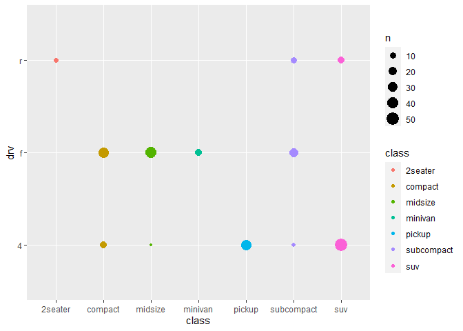

Solutions R for Dataseciece
================
Nagesh Bheesetty

CS 625, Fall 2020

### Goal:

To find solutions to all the exercise questions in the book “R for Data
Science”.

## Report:

**Importing the libraries “tidyverse”, and “lubridate”**.

    ## Warning: package 'tidyverse' was built under R version 4.0.3

    ## Warning: package 'ggplot2' was built under R version 4.0.3

    ## Warning: package 'readr' was built under R version 4.0.3

    ## Warning: package 'lubridate' was built under R version 4.0.3

The library “**tidyverse**” allows statisticians and data scientists to
create work-flow that facilitate communication and result in
reproducible work product. It consists a collection of R packages that
share an underlying design philosophy, grammar, and data structures.
this “tidyverse” makes data processing faster and easier. The most
important packages are:

  - ggplot
  - dplyr
  - tidyr
  - readr The library “**lubridate**” allowed me to edit the date format
    in the datasets.

## Source:

[R for Data Science](https://r4ds.had.co.nz/data-visualisation.html)

### 3 Data visualisation:

#### 3.2.1 The mpg data frame

``` r
mpg
```

    ## # A tibble: 234 x 11
    ##    manufacturer model    displ  year   cyl trans   drv     cty   hwy fl    class
    ##    <chr>        <chr>    <dbl> <int> <int> <chr>   <chr> <int> <int> <chr> <chr>
    ##  1 audi         a4         1.8  1999     4 auto(l~ f        18    29 p     comp~
    ##  2 audi         a4         1.8  1999     4 manual~ f        21    29 p     comp~
    ##  3 audi         a4         2    2008     4 manual~ f        20    31 p     comp~
    ##  4 audi         a4         2    2008     4 auto(a~ f        21    30 p     comp~
    ##  5 audi         a4         2.8  1999     6 auto(l~ f        16    26 p     comp~
    ##  6 audi         a4         2.8  1999     6 manual~ f        18    26 p     comp~
    ##  7 audi         a4         3.1  2008     6 auto(a~ f        18    27 p     comp~
    ##  8 audi         a4 quat~   1.8  1999     4 manual~ 4        18    26 p     comp~
    ##  9 audi         a4 quat~   1.8  1999     4 auto(l~ 4        16    25 p     comp~
    ## 10 audi         a4 quat~   2    2008     4 manual~ 4        20    28 p     comp~
    ## # ... with 224 more rows

Among the variables in `mpg` are:

`displ`, a car’s engine size, in litres.

`hwy`, a car’s fuel efficiency on the highway, in miles per gallon
(mpg). A car with a low fuel efficiency consumes more fuel than a car
with a high fuel efficiency when they travel the same distance.

To learn more about `mpg`, open its help page by running `?mpg`.

### 3.2.2 Creating a ggplot

``` r
ggplot(data = mpg) + 
  geom_point(mapping = aes(x = displ, y = hwy))
```

<!-- -->

### 3.2.3 A graphing template

    ggplot(data = <DATA>) + 
      <GEOM_FUNCTION>(mapping = aes(<MAPPINGS>))

### 3.2.4 Exercises

1.  Run `ggplot(data = mpg)`. What do you see?

2.  How many rows are in `mpg`? How many columns?

3.  What does the `drv` variable describe? Read the help for `?mpg` to
    find out.

4.  Make a scatterplot of `hwy` vs `cyl`.

5.  What happens if you make a scatterplot of `class` vs `drv`? Why is
    the plot not useful?

#### Solutions 3.2.4

**1. Run ggplot(data = mpg). What do you see?**

``` r
ggplot(data = mpg)
```

<!-- --> Just by
running `ggplot(data = mpg)` we could not see any output but only a
plot. However, the `ggplot(data = mpg)` must be added with the `geom`
functions.

**2. How many rows are in `mpg`? How many columns?**

``` r
mpg
```

    ## # A tibble: 234 x 11
    ##    manufacturer model    displ  year   cyl trans   drv     cty   hwy fl    class
    ##    <chr>        <chr>    <dbl> <int> <int> <chr>   <chr> <int> <int> <chr> <chr>
    ##  1 audi         a4         1.8  1999     4 auto(l~ f        18    29 p     comp~
    ##  2 audi         a4         1.8  1999     4 manual~ f        21    29 p     comp~
    ##  3 audi         a4         2    2008     4 manual~ f        20    31 p     comp~
    ##  4 audi         a4         2    2008     4 auto(a~ f        21    30 p     comp~
    ##  5 audi         a4         2.8  1999     6 auto(l~ f        16    26 p     comp~
    ##  6 audi         a4         2.8  1999     6 manual~ f        18    26 p     comp~
    ##  7 audi         a4         3.1  2008     6 auto(a~ f        18    27 p     comp~
    ##  8 audi         a4 quat~   1.8  1999     4 manual~ 4        18    26 p     comp~
    ##  9 audi         a4 quat~   1.8  1999     4 auto(l~ 4        16    25 p     comp~
    ## 10 audi         a4 quat~   2    2008     4 manual~ 4        20    28 p     comp~
    ## # ... with 224 more rows

By running `mpg` we can find the number of rows and columns.

It is observed that there are 234 rows and 11 columns.

To find the the number of rows and columns with out displaying the data,
we can use `nrow()` and `ncol()`.

``` r
# Number of rows in `mpg`
nrow(mpg)
```

    ## [1] 234

``` r
# Number of columns in `mpg`
ncol(mpg)
```

    ## [1] 11

The `glimpse()` function also displays the number of rows and columns in
a data frame

``` r
glimpse(mpg)
```

    ## Rows: 234
    ## Columns: 11
    ## $ manufacturer <chr> "audi", "audi", "audi", "audi", "audi", "audi", "audi"...
    ## $ model        <chr> "a4", "a4", "a4", "a4", "a4", "a4", "a4", "a4 quattro"...
    ## $ displ        <dbl> 1.8, 1.8, 2.0, 2.0, 2.8, 2.8, 3.1, 1.8, 1.8, 2.0, 2.0,...
    ## $ year         <int> 1999, 1999, 2008, 2008, 1999, 1999, 2008, 1999, 1999, ...
    ## $ cyl          <int> 4, 4, 4, 4, 6, 6, 6, 4, 4, 4, 4, 6, 6, 6, 6, 6, 6, 8, ...
    ## $ trans        <chr> "auto(l5)", "manual(m5)", "manual(m6)", "auto(av)", "a...
    ## $ drv          <chr> "f", "f", "f", "f", "f", "f", "f", "4", "4", "4", "4",...
    ## $ cty          <int> 18, 21, 20, 21, 16, 18, 18, 18, 16, 20, 19, 15, 17, 17...
    ## $ hwy          <int> 29, 29, 31, 30, 26, 26, 27, 26, 25, 28, 27, 25, 25, 25...
    ## $ fl           <chr> "p", "p", "p", "p", "p", "p", "p", "p", "p", "p", "p",...
    ## $ class        <chr> "compact", "compact", "compact", "compact", "compact",...

**3. What does the `drv` variable describe? Read the help for `?mpg` to
find out.**

``` r
?mpg
```

    ## starting httpd help server ... done

| Value | Description              |
| ----- | ------------------------ |
| drv   | the type of driven train |
| “f”   | front-wheel drive        |
| “r”   | rear-wheel drive         |
| “4”   | 4wd                      |

**4. Make a scatterplot of `hwy` vs `cyl`**.

``` r
ggplot(data = mpg) + 
  geom_point(mapping = aes(x = hwy, y = cyl))
```

<!-- -->

**5. What happens if you make a scatterplot of `class` vs `drv`? Why is
the plot not useful?**

``` r
ggplot(data = mpg) + 
  geom_point(mapping = aes(x = class, y = drv))
```

<!-- -->

Scatterplot can basically establish relation between two quantitative
variables to find the trend and relation between the variables. In this
case `class` and `drv` are both categorical variables. So, the plot is
not useful.

``` r
count(mpg, drv, class)
```

    ## # A tibble: 12 x 3
    ##    drv   class          n
    ##    <chr> <chr>      <int>
    ##  1 4     compact       12
    ##  2 4     midsize        3
    ##  3 4     pickup        33
    ##  4 4     subcompact     4
    ##  5 4     suv           51
    ##  6 f     compact       35
    ##  7 f     midsize       38
    ##  8 f     minivan       11
    ##  9 f     subcompact    22
    ## 10 r     2seater        5
    ## 11 r     subcompact     9
    ## 12 r     suv           11

``` r
ggplot(mpg, aes(x = class, y = drv, color = class)) + 
    geom_count()
```

<!-- -->

### 3.3 Aesthetic mappings

Color is a good idea to distinguish the categorical types within the
values.

``` r
ggplot(data = mpg) + 
  geom_point(mapping = aes(x = displ, y = hwy, color = class))
```

<!-- -->

``` r
ggplot(data = mpg) + 
  geom_point(mapping = aes(x = displ, y = hwy, size = class))
```

    ## Warning: Using size for a discrete variable is not advised.

<!-- -->

``` r
#> Warning: Using size for a discrete variable is not advised.
```

**Line Graph for COVID-19:**

    COVID <- read.csv("./HW7_datasets/COVID-19.csv")
    #head(COVID)
    COVID$date<-mdy(COVID$date)
    COVID19 <- select(COVID, date, cases)
    COVID19 <- rename(COVID19, Date = date)
    # #head(COVID19)
    COVID19<- mutate(COVID19, Percentage = cases/sum(cases))
    head(COVID19)
    ggplot(data = COVID19, mapping = aes(x = Date, y = Percentage)) +
      geom_line(size=1.5, color="red")+
      geom_point(size=0.5, color="blue")+labs(x="Jan-2020 to Nov-2020", y ="Number of cases" , title = "COVID-19 cases from Jan-2020 through Nov-2020")

**Line Graph for Gold Stock:**

\`\`\`{, echo=FALSE} Gold\<-read.csv(“./HW7\_datasets/gold\_yahoo.csv”)
\#head(Gold)

Gold\(Date<-as.Date(Gold\)Date)

Gold \<- select(Gold, Date, Open) Gold \<- rename(Gold, Price = Open)
\#head(Gold) Gold\<- mutate(Gold, Percentage = Price\*100/sum(Price))
Gold = filter(Gold, Date \> as.Date(“2019-11-01”,“%Y-%m-%d”))
\#head(Gold)

ggplot(data = Gold, mapping = aes(x = Date, y = Price)) +

geom\_point(size=1.5, color=“blue”) + geom\_line(size = 0.5, color =
“green”)+theme(axis.text.x = element\_text(angle=45, hjust =
1))+labs(x=“Jan-2019 to Nov-2020”, y =“Stock price in dollars” , title =
“Gold stock price from Jan-2019 through Nov-2020”)

```` 

**Line Graph for Gas Prices:**


```{, echo= FALSE}
Gas<-read.csv("./HW7_datasets/gas_monthly_csv.csv")
#head(Gas)
Gas$Date = as.Date(paste(Gas$Month,"-01",sep=""))
Gas = filter(Gas, Date > as.Date("2019-11-01","%Y-%m-%d"))
#head(Gas)
Gas <- select(Gas, Date, Price)
#Gold <- rename(Gold, Price = Open)
#head(Gas)
Gas<- mutate(Gas, Percentage = Price*100/sum(Price))
#head(Gas)

ggplot(data = Gas, mapping = aes(x = Date, y = Price)) +

  geom_line(size=1, color="purple")+
  geom_point(size=1.5, color="blue")+theme(axis.text.x = element_text(angle=45, hjust = 1))+labs(x="Jan-2019 to Nov-2020", y ="Gas price in dollars" , title = "Gas price from Jan-2019 through Nov-2020")
````

**Line Graph for SP500:**

\`\`\`{, echo= FALSE}
SP500\<-read.csv(“./HW7\_datasets/S\&P500\_yahoo.csv”) \#head(SP500)
SP500\(Date = as.Date(SP500\)Date) \#head(SP500) SP500 \<- select(SP500,
Date, Open) SP500 \<- rename(SP500, Price = Open) \#head(SP500) SP500\<-
mutate(SP500, Percentage = Price\*100/sum(Price)) \#head(SP500) SP500 =
filter(SP500, Date \> as.Date(“2019-11-01”,“%Y-%m-%d”)) \#head(SP500)
ggplot(data = SP500, mapping = aes(x = Date, y = Price)) +

geom\_line(size=1, color=“orange”)+ geom\_point(size=1.5, color=“blue”)+

theme(axis.text.x = element\_text(angle=45, hjust = 1))+labs(x=“Jan-2019
to Nov-2020”, y =“Stock price in dollars” , title = “S\&P500 stock price
from Jan-2019 through Nov-2020”)

\`\`\`

**Procedures and Design Decisions**

| Idiom:         | Smallmultiple line graphs                          |
| -------------- | -------------------------------------------------- |
| X-Axis:        | Jan-2020 to Nov-2020 (first letters of each month) |
| Y-Axis(left):  | COVID (Number of cases)                            |
| Y-Axis(Right): | Comparison Attributes (Unemployment, Gas, Stocks)  |

### Explanation:

### References:

**Change the Date format:**
[STATMETHODS](https://www.statmethods.net/input/dates.html)

**Add Colors to each line:** [Colors in R]()

**How to Export DataFrame to CSV in R:** [Data to
Fish](https://datatofish.com/export-dataframe-to-csv-in-r/)

**library(tidyverse):**
<https://ggplot2.tidyverse.org/reference/index.html>

**Split the date:** [Stack
overflow](https://stackoverflow.com/questions/4310326/convert-character-to-date-in-r)

**Exploratory Data Analysis:(EDA)** [R for Data
Science](https://r4ds.had.co.nz/)
