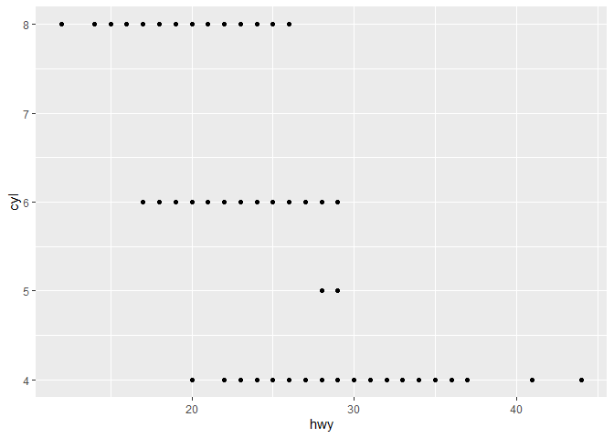
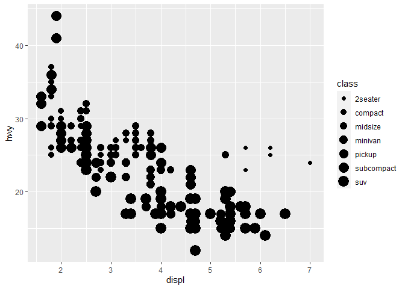

Solutions R for Dataseciece
================
Nagesh Bheesetty

CS 625, Fall 2020

### Goal:

To find solutions to all the exercise questions in the book “**R for
Data Science**”.

## Report:

**Importing the libraries “tidyverse”, and “lubridate”**.

    ## Warning: package 'tidyverse' was built under R version 4.0.3

    ## Warning: package 'ggplot2' was built under R version 4.0.3

    ## Warning: package 'readr' was built under R version 4.0.3

    ## Warning: package 'lubridate' was built under R version 4.0.3

The library “**tidyverse**” allows statisticians and data scientists to
create work-flow that facilitate communication and result in
reproducible work product. It consists a collection of R packages that
share an underlying design philosophy, grammar, and data structures.
this “tidyverse” makes data processing faster and easier. The most
important packages are:

  - ggplot
  - dplyr
  - tidyr
  - readr The library “**lubridate**” allowed me to edit the date format
    in the datasets.

## Source:

[R for Data Science](https://r4ds.had.co.nz/data-visualisation.html)

### Chapter-3:(Data visualisation)

#### 3.2.1 The `mpg` data frame

``` r
mpg
```

    ## # A tibble: 234 x 11
    ##    manufacturer model    displ  year   cyl trans   drv     cty   hwy fl    class
    ##    <chr>        <chr>    <dbl> <int> <int> <chr>   <chr> <int> <int> <chr> <chr>
    ##  1 audi         a4         1.8  1999     4 auto(l~ f        18    29 p     comp~
    ##  2 audi         a4         1.8  1999     4 manual~ f        21    29 p     comp~
    ##  3 audi         a4         2    2008     4 manual~ f        20    31 p     comp~
    ##  4 audi         a4         2    2008     4 auto(a~ f        21    30 p     comp~
    ##  5 audi         a4         2.8  1999     6 auto(l~ f        16    26 p     comp~
    ##  6 audi         a4         2.8  1999     6 manual~ f        18    26 p     comp~
    ##  7 audi         a4         3.1  2008     6 auto(a~ f        18    27 p     comp~
    ##  8 audi         a4 quat~   1.8  1999     4 manual~ 4        18    26 p     comp~
    ##  9 audi         a4 quat~   1.8  1999     4 auto(l~ 4        16    25 p     comp~
    ## 10 audi         a4 quat~   2    2008     4 manual~ 4        20    28 p     comp~
    ## # ... with 224 more rows

Among the variables in `mpg` are:

`displ`, a car’s engine size, in litres.

`hwy`, a car’s fuel efficiency on the highway, in miles per gallon
(mpg). A car with a low fuel efficiency consumes more fuel than a car
with a high fuel efficiency when they travel the same distance.

To learn more about `mpg`, open its help page by running `?mpg`.

### 3.2.2 Creating a ggplot

``` r
ggplot(data = mpg) + 
  geom_point(mapping = aes(x = displ, y = hwy))
```

<!-- -->

### 3.2.3 A graphing template

    ggplot(data = <DATA>) + 
      <GEOM_FUNCTION>(mapping = aes(<MAPPINGS>))

### 3.2.4 Exercises

1.  Run `ggplot(data = mpg)`. What do you see?

2.  How many rows are in `mpg`? How many columns?

3.  What does the `drv` variable describe? Read the help for `?mpg` to
    find out.

4.  Make a scatterplot of `hwy` vs `cyl`.

5.  What happens if you make a scatterplot of `class` vs `drv`? Why is
    the plot not useful?

#### Solutions 3.2.4

**1. Run `ggplot(data = mpg)`. What do you see?**

``` r
ggplot(data = mpg)
```

<!-- --> Just by
running `ggplot(data = mpg)` we could not see any output, except a plot.
Because, `ggplot()` is not instructed what to plot. It means we should
define a plot between two `variables` (attributes in the columns). So,
the `ggplot(data = mpg)` must be added with the `geom` functions.

**2. How many rows are in `mpg`? How many columns?**

There are multiple ways to find the number fo rows and columns in the
data frame.

  - Just by giving the data (say `mpg`) we can find the number of rows
    and columns, but this will run the whole data frame as well. That
    means a lot of bites and space.

<!-- end list -->

``` r
mpg
```

    ## # A tibble: 234 x 11
    ##    manufacturer model    displ  year   cyl trans   drv     cty   hwy fl    class
    ##    <chr>        <chr>    <dbl> <int> <int> <chr>   <chr> <int> <int> <chr> <chr>
    ##  1 audi         a4         1.8  1999     4 auto(l~ f        18    29 p     comp~
    ##  2 audi         a4         1.8  1999     4 manual~ f        21    29 p     comp~
    ##  3 audi         a4         2    2008     4 manual~ f        20    31 p     comp~
    ##  4 audi         a4         2    2008     4 auto(a~ f        21    30 p     comp~
    ##  5 audi         a4         2.8  1999     6 auto(l~ f        16    26 p     comp~
    ##  6 audi         a4         2.8  1999     6 manual~ f        18    26 p     comp~
    ##  7 audi         a4         3.1  2008     6 auto(a~ f        18    27 p     comp~
    ##  8 audi         a4 quat~   1.8  1999     4 manual~ 4        18    26 p     comp~
    ##  9 audi         a4 quat~   1.8  1999     4 auto(l~ 4        16    25 p     comp~
    ## 10 audi         a4 quat~   2    2008     4 manual~ 4        20    28 p     comp~
    ## # ... with 224 more rows

It is observed that there are 234 rows and 11 columns.

  - The best way to find the the number of `rows` and `columns` with out
    displaying the data frame is to use commands `nrow()` and `ncol()`.

<!-- end list -->

``` r
# Number of rows in `mpg`
nrow(mpg)
```

    ## [1] 234

``` r
# Number of columns in `mpg`
ncol(mpg)
```

    ## [1] 11

This will display the number of rows and columns.

1 Rows: 234

2 Columns: 11

  - The alternate way is `glimpse()` function which can also display the
    number of rows and columns in a data frame

<!-- end list -->

``` r
glimpse(mpg)
```

    ## Rows: 234
    ## Columns: 11
    ## $ manufacturer <chr> "audi", "audi", "audi", "audi", "audi", "audi", "audi"...
    ## $ model        <chr> "a4", "a4", "a4", "a4", "a4", "a4", "a4", "a4 quattro"...
    ## $ displ        <dbl> 1.8, 1.8, 2.0, 2.0, 2.8, 2.8, 3.1, 1.8, 1.8, 2.0, 2.0,...
    ## $ year         <int> 1999, 1999, 2008, 2008, 1999, 1999, 2008, 1999, 1999, ...
    ## $ cyl          <int> 4, 4, 4, 4, 6, 6, 6, 4, 4, 4, 4, 6, 6, 6, 6, 6, 6, 8, ...
    ## $ trans        <chr> "auto(l5)", "manual(m5)", "manual(m6)", "auto(av)", "a...
    ## $ drv          <chr> "f", "f", "f", "f", "f", "f", "f", "4", "4", "4", "4",...
    ## $ cty          <int> 18, 21, 20, 21, 16, 18, 18, 18, 16, 20, 19, 15, 17, 17...
    ## $ hwy          <int> 29, 29, 31, 30, 26, 26, 27, 26, 25, 28, 27, 25, 25, 25...
    ## $ fl           <chr> "p", "p", "p", "p", "p", "p", "p", "p", "p", "p", "p",...
    ## $ class        <chr> "compact", "compact", "compact", "compact", "compact",...

This function `glimpse()` is good to find all the columns in a row and
the attribute types can be easily identified.

In the above output it can be observed that out of the 11 columns 6
attributes are categorical and 5 of them are quantitative.

Assume a data frame with 20, 40, or more number of columns all the
attribute types can be identified.

**3. What does the `drv` variable describe? Read the help for `?mpg` to
find out.**

``` r
?mpg
```

    ## starting httpd help server ... done

| Value | Description              |
| ----- | ------------------------ |
| drv   | the type of driven train |
| “f”   | front-wheel drive        |
| “r”   | rear-wheel drive         |
| “4”   | 4wd                      |

Most of the times we see a data attributes with short words or
abbreviations and we may also see some short form of categorical
information in the columns.

By running `?data` say `?mpg` the information about the data can be
identified.

I believe the predefined packages in *ggplot* has the description about
the data.

**4. Make a scatterplot of `hwy` vs `cyl`**.

``` r
ggplot(data = mpg) + 
  geom_point(mapping = aes(x = hwy, y = cyl))
```

<!-- -->

A scatterplot is a point mapping between two quantitative variables.

It is very important to ask a question in how to establish a relation,
in general we tend to establish relation between one quantitative
attribute varies with respect to the other.

For example, as x changes there could be a change in y. So, x is placed
on x-axis and y is placed on y-axis.

In the above question the task is to establish a relation between `hwy`
and `cyl`. So, let us understand the attributes:

hwy \(-->\) highway miles per gallon

cyl \(-->\) number of cylinders

Might the two given attributes may or may not be correlated, however we
can make a question and clarify that as the number of cylinders changes
in the cars, the miles per gallon could vary but by increasing the miles
per gallon we can not chane the number of cylinders in the car.

So, on the x-axis we need `cyl` and on the y-axis we can place `hwy`.

Lets run the code by changing the attributes.

``` r
ggplot(data = mpg) + 
  geom_point(mapping = aes(y = hwy, x = cyl))
```

<!-- -->

However, it is evident that there is no relation between `cyl` and
`hwy`.

**5. What happens if you make a scatterplot of `class` vs `drv`? Why is
the plot not useful?**

``` r
ggplot(data = mpg) + 
  geom_point(mapping = aes(x = class, y = drv))
```

<!-- -->

Scatterplot can basically establish relation between two quantitative
variables to find the trend and relation between the variables. In this
case `class` and `drv` are both categorical variables. So, the plot is
not useful.

This can be more clearly observed from the concepts in other chapters.

``` r
count(mpg, drv, class)
```

    ## # A tibble: 12 x 3
    ##    drv   class          n
    ##    <chr> <chr>      <int>
    ##  1 4     compact       12
    ##  2 4     midsize        3
    ##  3 4     pickup        33
    ##  4 4     subcompact     4
    ##  5 4     suv           51
    ##  6 f     compact       35
    ##  7 f     midsize       38
    ##  8 f     minivan       11
    ##  9 f     subcompact    22
    ## 10 r     2seater        5
    ## 11 r     subcompact     9
    ## 12 r     suv           11

``` r
ggplot(mpg, aes(x = class, y = drv, color = class)) + 
    geom_count()
```

<!-- -->

## 3.3 Aesthetic mappings

Color is a good idea to distinguish the categorical types within the
values.

``` r
ggplot(data = mpg) + 
  geom_point(mapping = aes(x = displ, y = hwy, color = class))
```

<!-- -->

``` r
ggplot(data = mpg) + 
  geom_point(mapping = aes(x = displ, y = hwy, size = class))
```

    ## Warning: Using size for a discrete variable is not advised.

<!-- -->

``` r
#> Warning: Using size for a discrete variable is not advised.

# Left
ggplot(data = mpg) + 
  geom_point(mapping = aes(x = displ, y = hwy, alpha = class))
```

    ## Warning: Using alpha for a discrete variable is not advised.

<!-- -->

``` r
# Right
ggplot(data = mpg) + 
  geom_point(mapping = aes(x = displ, y = hwy, shape = class, color = class))
```

    ## Warning: The shape palette can deal with a maximum of 6 discrete values because
    ## more than 6 becomes difficult to discriminate; you have 7. Consider
    ## specifying shapes manually if you must have them.

    ## Warning: Removed 62 rows containing missing values (geom_point).

<!-- -->

``` r
ggplot(data = mpg) + 
  geom_point(mapping = aes(x = displ, y = hwy), color = "blue")
```

<!-- -->

### Exercise 3.3.1

`What’s gone wrong with this code? Why are the points not blue?`

``` r
ggplot(data = mpg) + 
  geom_point(mapping = aes(x = displ, y = hwy, color = "blue"))
```

<!-- -->

``` r
ggplot(data = mpg) + 
  geom_point(mapping = aes(x = displ, y = hwy, color = class))
```

<!-- -->

``` r
ggplot(data = mpg) + 
  geom_point(mapping = aes(x = displ, y = hwy), color = "blue")
```

<!-- -->

We know that an aesthetic is a visual property of the objects in your
plot. Aesthetics include things like the size, the shape, or the color
of your points.

  - In the first case even the color = “blue” is give we could see the
    color as red but not blue. Because the the aesthetic is assigned to
    the variables(attribute type).
    
    The argument `colour = "blue"` is included within the `mapping`
    argument, and as such, it is treated as an aesthetic, which is a
    mapping between a variable and a value. In the expression, `colour =
    "blue"`, “`blue`” is interpreted as a categorical variable which
    only takes a single value “`blue`”. If this is confusing, consider
    how `colour = 1:234` and `colour = 1` are interpreted by `aes()`.

`The second code still does not produces the expected result`.

  - We can convey information about your data by mapping the aesthetics
    in your plot to the variables in your dataset. For example, we can
    map the colors of your points to the class variable to reveal the
    class of each car.

`The third code does produces the expected result`.

  - We can also set the aesthetic properties of your geom manually. For
    example, we can make all of the points in our plot blue

### Exercise 3.3.2

`Which variables in` `mpg` `are categorical? Which variables are
continuous? (Hint: type` `?mpg` `to read the documentation for the
dataset). How can you see this information when you run` `mpg?`

``` r
mpg
```

    ## # A tibble: 234 x 11
    ##    manufacturer model    displ  year   cyl trans   drv     cty   hwy fl    class
    ##    <chr>        <chr>    <dbl> <int> <int> <chr>   <chr> <int> <int> <chr> <chr>
    ##  1 audi         a4         1.8  1999     4 auto(l~ f        18    29 p     comp~
    ##  2 audi         a4         1.8  1999     4 manual~ f        21    29 p     comp~
    ##  3 audi         a4         2    2008     4 manual~ f        20    31 p     comp~
    ##  4 audi         a4         2    2008     4 auto(a~ f        21    30 p     comp~
    ##  5 audi         a4         2.8  1999     6 auto(l~ f        16    26 p     comp~
    ##  6 audi         a4         2.8  1999     6 manual~ f        18    26 p     comp~
    ##  7 audi         a4         3.1  2008     6 auto(a~ f        18    27 p     comp~
    ##  8 audi         a4 quat~   1.8  1999     4 manual~ 4        18    26 p     comp~
    ##  9 audi         a4 quat~   1.8  1999     4 auto(l~ 4        16    25 p     comp~
    ## 10 audi         a4 quat~   2    2008     4 manual~ 4        20    28 p     comp~
    ## # ... with 224 more rows

``` r
?mpg

glimpse(mpg)
```

    ## Rows: 234
    ## Columns: 11
    ## $ manufacturer <chr> "audi", "audi", "audi", "audi", "audi", "audi", "audi"...
    ## $ model        <chr> "a4", "a4", "a4", "a4", "a4", "a4", "a4", "a4 quattro"...
    ## $ displ        <dbl> 1.8, 1.8, 2.0, 2.0, 2.8, 2.8, 3.1, 1.8, 1.8, 2.0, 2.0,...
    ## $ year         <int> 1999, 1999, 2008, 2008, 1999, 1999, 2008, 1999, 1999, ...
    ## $ cyl          <int> 4, 4, 4, 4, 6, 6, 6, 4, 4, 4, 4, 6, 6, 6, 6, 6, 6, 8, ...
    ## $ trans        <chr> "auto(l5)", "manual(m5)", "manual(m6)", "auto(av)", "a...
    ## $ drv          <chr> "f", "f", "f", "f", "f", "f", "f", "4", "4", "4", "4",...
    ## $ cty          <int> 18, 21, 20, 21, 16, 18, 18, 18, 16, 20, 19, 15, 17, 17...
    ## $ hwy          <int> 29, 29, 31, 30, 26, 26, 27, 26, 25, 28, 27, 25, 25, 25...
    ## $ fl           <chr> "p", "p", "p", "p", "p", "p", "p", "p", "p", "p", "p",...
    ## $ class        <chr> "compact", "compact", "compact", "compact", "compact",...

In the printed data frame, angled brackets at the top of each column
provide type of each variable.

Those with `<chr>` above their columns are categorical, while those with
`<dbl>` or `<int>` are continuous.

The following list contains the categorical variables in `mpg`:

  - manufacturer
  - model
  - trans
  - drv
  - fl
  - class\*

The following list contains the continuous variables in `mpg`:

  - displ
  - year
  - cyl
  - cty
  - hwy

`glimpse()` is another function that concisely displays the type of each
column in the data frame:

This gives more visibility in identifying the variable types.

For those lists, I considered any variable that was non-numeric was
considered categorical and any variable that was numeric was considered
continuous. This largely corresponds to the heuristics ggplot() uses for
will interpreting variables as discrete or continuous.

### Exercise 3.3.3

`Map a continuous variable to color, size, and shape. How do these
aesthetics behave differently for categorical vs. continuous variables?`

The variable `hwy`, highway miles per gallon, is a continuous variable

``` r
ggplot(mpg, aes(x = displ, y = hwy, colour = hwy)) +
  geom_point()
```

<!-- -->

``` r
ggplot(mpg, aes(x = displ, y = hwy, size = hwy)) +
  geom_point()
```

<!-- -->

    ggplot(mpg, aes(x = displ, y = hwy, shape = hwy)) +
      geom_point()
    #> Error: A continuous variable can not be mapped to shape

When a continuous value is mapped to shape, it gives an error. Though we
could split a continuous variable into discrete categories and use a
shape aesthetic, this would conceptually not make sense. A numeric
variable has an order, but shapes do not. It is clear that smaller
points correspond to smaller values, or once the color scale is given,
which colors correspond to larger or smaller values. But it is not clear
whether a square is greater or less than a circle.

``` r
ggplot(mpg, aes(x = displ, y = hwy, shape = class)) +
  geom_point()
```

    ## Warning: The shape palette can deal with a maximum of 6 discrete values because
    ## more than 6 becomes difficult to discriminate; you have 7. Consider
    ## specifying shapes manually if you must have them.

    ## Warning: Removed 62 rows containing missing values (geom_point).

<!-- -->

### Exercise 3.3.4

`What happens if you map the same variable to multiple aesthetics?`

``` r
ggplot(mpg, aes(x = displ, y = hwy, colour = hwy, size = displ)) +
  geom_point()
```

<!-- -->

In the above plot, hwy is mapped to both location on the y-axis and
color, and displ is mapped to both location on the x-axis and size. The
code works and produces a plot, even if it is a bad one. Mapping a
single variable to multiple aesthetics is redundant. Because it is
redundant information, in most cases avoid mapping a single variable to
multiple aesthetics.

### Exercise 3.3.5

`What does the stroke aesthetic do? What shapes does it work with?
(Hint: use ?geom_point)`

Stroke changes the size of the border for shapes (21-25). These are
filled shapes in which the color and size of the border can differ from
that of the filled interior of the shape.

``` r
ggplot(mtcars, aes(wt, mpg)) +
  geom_point(shape = 21, colour = "blue", fill = "red", size = 5, stroke = 5)
```

<!-- -->

``` r
ggplot(mpg, aes(x = displ, y = hwy)) +
  geom_point(shape = 23, colour = "blue", fill = "red", size = 5, stroke = 2)
```

<!-- -->


### Exercise 3.3.6

`What happens if you map an aesthetic to something other than a variable
name, like aes(colour = displ < 5)? Note, you’ll also need to specify x
and y.`

``` r
ggplot(data = mpg) + 
  geom_point(mapping = aes(x = displ, y = hwy), color = "blue")
```

<!-- -->

``` r
ggplot(data = mpg) + 
  geom_point(mapping = aes(x = displ, y = hwy, colour = displ))
```

<!-- -->

``` r
ggplot(mpg, aes(x = displ, y = hwy, colour = displ < 5)) +
  geom_point()
```

<!-- -->

Aesthetics can also be mapped to expressions like displ \< 5. The
ggplot() function behaves as if a temporary variable was added to the
data with values equal to the result of the expression. In this case,
the result of displ \< 5 is a logical variable which takes values of
TRUE or FALSE.

### References:

**Change the Date format:**
[STATMETHODS](https://www.statmethods.net/input/dates.html)

**Add Colors to each line:** [Colors in R]()

**How to Export DataFrame to CSV in R:** [Data to
Fish](https://datatofish.com/export-dataframe-to-csv-in-r/)

**library(tidyverse):**
<https://ggplot2.tidyverse.org/reference/index.html>

**Split the date:** [Stack
overflow](https://stackoverflow.com/questions/4310326/convert-character-to-date-in-r)

**Exploratory Data Analysis:(EDA)** [R for Data
Science](https://r4ds.had.co.nz/)
